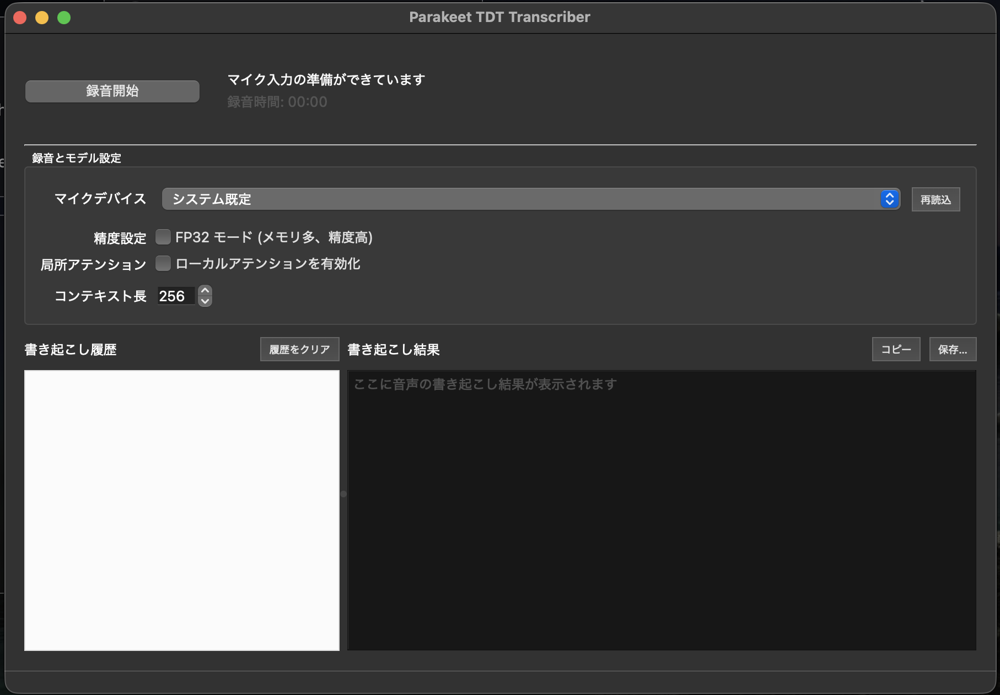

# Parakeet TDT Transcriber for Japanese Audio

This is a one-click desktop tool for **macOS** that handles everything from **microphone recording** and **inference** to **transcription history management**. It is designed to bundle the `parakeet-mlx` **Parakeet-TDT (0.6B) model** running on the **Apple MLX backend**, providing fast **local transcription for Japanese audio**.



- [Parakeet TDT Transcriber for Japanese Audio](#parakeet-tdt-transcriber-for-japanese-audio)
  - [Key Features](#key-features)
  - [Prerequisites](#prerequisites)
  - [How to Use](#how-to-use)
  - [Standalone Bundle with PyInstaller](#standalone-bundle-with-pyinstaller)
    - [Automatic Release with GitHub Actions](#automatic-release-with-github-actions)
    - [PyInstaller Setup Notes](#pyinstaller-setup-notes)
  - [About the Model](#about-the-model)
- [Parakeet TDT Transcriber for Japanese Audio (日本語 README)](#parakeet-tdt-transcriber-for-japanese-audio-日本語-readme)
  - [主な機能](#主な機能)
  - [必要要件](#必要要件)
  - [使い方](#使い方)
  - [PyInstaller によるスタンドアロンバンドル](#pyinstaller-によるスタンドアロンバンドル)
    - [GitHub Actions での自動リリース](#github-actions-での自動リリース)
    - [PyInstaller セットアップのポイント](#pyinstaller-セットアップのポイント)
  - [モデルについて](#モデルについて)

---

## Key Features

- **One-Step Transcription**: A single button controls the entire process, from starting to stopping the recording and performing the inference. The header displays the elapsed time and processing status.
- **Microphone Device Selection**: Available input devices are listed automatically and can be switched via a dropdown menu.
- **Model Settings**: Easily toggle **FP32 mode** and **Local Attention** activation, or adjust the context window width via the GUI.
- **Transcription History**: Multiple transcription results are saved within the session. You can re-display any result by simply selecting it from the history list. Results can be copied or deleted via the context menu.
- **Export**: Generate text can be copied to the clipboard or saved as a file with a single click.

---

## Prerequisites

- **macOS 14 or later** / **Apple Silicon** is recommended
- **Python 3.13**
- **[uv](https://github.com/astral-sh/uv)** (for dependency resolution)
- **[ffmpeg](https://ffmpeg.org/)** (for recording and conversion)

---

## How to Use

1. Set up the dependencies.

```bash
uv sync
```

2.  Start the application.

```bash
uv run python main.py
```

*The first time you run the app, macOS may ask for permission to use the microphone. Please grant permission to `uv` (Python) in **System Settings \> Privacy & Security \> Microphone**.*

3.  Press the **Start Recording** button to begin recording. Press it again to stop, and transcription will start automatically.
4.  The transcription result will appear in the central text view. The result is also added to the history list, and clicking on a different entry will re-display its content.
5.  To use the result, click the **Copy** button or the **Save...** button on the right side of the header.

-----

## Standalone Bundle with PyInstaller

You can use **PyInstaller** to create a single distribution package that includes the application, its dependent libraries, and the `ffmpeg` binary.

1.  Install additional dependencies.

    ```bash
    uv sync --extra bundle
    ```

2.  Prepare a static **`ffmpeg` binary for macOS** and ensure the app can access it. Example:

    ```bash
    mkdir -p build/ffmpeg
    curl -L -o build/ffmpeg/ffmpeg.zip [https://evermeet.cx/ffmpeg/getrelease/zip](https://evermeet.cx/ffmpeg/getrelease/zip)
    unzip -o build/ffmpeg/ffmpeg.zip -d build/ffmpeg
    chmod +x build/ffmpeg/ffmpeg
    ```

    *If you want to use your existing Homebrew version, use the path obtained from `which ffmpeg`.*

3.  Build the application with PyInstaller. Specifying the binary with `PARAKEET_FFMPEG_PATH` will ensure it is copied to `Parakeet TDT.app/Contents/MacOS/bin/ffmpeg` in the generated package.

    ```bash
  PARAKEET_FFMPEG_PATH="$(pwd)/build/ffmpeg/ffmpeg" \
  uv run pyinstaller packaging/pyinstaller/parakeet.spec
    ```

    The output will be generated in the `dist/parakeet-tdt` directory containing the **`Parakeet TDT.app` bundle**.

4.  Check the generated files.

      - Launch `dist/parakeet-tdt/Parakeet TDT.app` from Finder to confirm functionality.
      - Verify that `dist/parakeet-tdt/Parakeet TDT.app/Contents/MacOS/bin/ffmpeg` exists and has `+x` permissions.
      - Before distribution, check that no unnecessary cache files (like `build/` artifacts or `.DS_Store`) have been included.

### Automatic Release with GitHub Actions

  - Pushing a new tag (a semantic version starting with `v*`) will trigger GitHub Actions to run the PyInstaller build on a macOS Runner, creating a `.zip` and `.dmg` that contain `Parakeet TDT.app` bundled with the `ffmpeg` binary fetched from evermeet.cx. (The artifacts are **not code-signed**; Gatekeeper will show a warning the first time.)

### PyInstaller Setup Notes

  - If **`PARAKEET_FFMPEG_PATH`** is not specified, the application will fall back to the OS-installed `ffmpeg`. To ensure complete dependency freedom, you must set this variable.
  - This setup assumes operation on **Apple Silicon macOS**. Distribution for Intel may require additional verification and code signing.

-----

## About the Model

The application uses the **`mlx-community/parakeet-tdt_ctc-0.6b-ja`** model. Switching to other models is currently not supported due to considerations of accuracy and operational stability. The initial launch may take some time as the model 
is downloaded.

---

# Parakeet TDT Transcriber for Japanese Audio (日本語 README)

macOS 向けのデスクトップアプリとして、マイクからの録音・推論・書き起こし履歴の管理までをワンクリックで完結させるツールです。Apple MLX バックエンドで動作する `parakeet-mlx` Parakeet-TDT (0.6B) モデルを同梱前提で扱い、日本語音声の高速なローカル書き起こしをサポートします。


## 主な機能

- **ワンステップ書き起こし**: 録音開始から停止・推論までを 1 つのボタンで操作。経過時間と処理状況をヘッダーに表示します。
- **マイクデバイス選択**: 利用可能な入力デバイスを自動列挙し、ドロップダウンから切り替えられます。
- **モデル設定**: FP32 モードやローカルアテンションの有効化／コンテキスト幅の調整を GUI で切り替え。
- **書き起こし履歴**: セッション内に複数の書き起こし結果を保存し、選択するだけで結果を再表示。コンテキストメニューからコピーや削除が可能です。
- **エクスポート**: 生成テキストをワンクリックでクリップボードにコピー、またはファイルとして保存できます。

## 必要要件

- macOS 14 以降 / Apple Silicon を推奨
- Python 3.13
- [uv](https://github.com/astral-sh/uv)（依存解決用）
- [ffmpeg](https://ffmpeg.org/)（録音・変換処理用）

## 使い方

1. 依存関係をセットアップします。

   ```bash
   uv sync
   ```

2. アプリケーションを起動します。

   ```bash
   uv run python main.py
   ```

   初回起動時は macOS からマイク使用許可を求められる場合があります。`システム設定 > プライバシーとセキュリティ > マイク` で `uv`（Python） に権限を付与してください。

3. **録音開始** ボタンを押すと録音がスタートします。もう一度押すと録音が停止し、自動で書き起こしが始まります。

4. 書き起こし結果は中央のテキストビューに表示されます。履歴リストに結果が追加され、他の履歴をクリックするとその内容を再表示できます。

5. 結果を利用したい場合は、ヘッダー右側の **コピー** ボタン、または **保存…** ボタンを押してください。

## PyInstaller によるスタンドアロンバンドル

PyInstaller を使ってアプリ本体と依存ライブラリ、`ffmpeg` バイナリをひとまとめにした配布物を生成できます。

1. 依存関係を追加でインストールします。

   ```bash
   uv sync --extra bundle
   ```

2. macOS 用の静的 `ffmpeg` バイナリを準備し、アプリが参照できるようにします。例:

   ```bash
   mkdir -p build/ffmpeg
   curl -L -o build/ffmpeg/ffmpeg.zip https://evermeet.cx/ffmpeg/getrelease/zip
   unzip -o build/ffmpeg/ffmpeg.zip -d build/ffmpeg
   chmod +x build/ffmpeg/ffmpeg
   ```

   ※ 既存の Homebrew 版を利用する場合は `which ffmpeg` で得られるパスを使ってください。

3. PyInstaller でビルドします。`PARAKEET_FFMPEG_PATH` にバイナリを指定すると、生成物の `Parakeet TDT.app/Contents/MacOS/bin/ffmpeg` にコピーされます。

   ```bash
  PARAKEET_FFMPEG_PATH="$(pwd)/build/ffmpeg/ffmpeg" \
  uv run pyinstaller packaging/pyinstaller/parakeet.spec
   ```

  出力は `dist/parakeet-tdt` ディレクトリに生成されます（`Parakeet TDT.app` バンドルが含まれます）。

4. 生成物をチェックします。

  - `dist/parakeet-tdt/Parakeet TDT.app` を Finder から起動して動作確認します。
  - `dist/parakeet-tdt/Parakeet TDT.app/Contents/MacOS/bin/ffmpeg` が存在し、権限が `+x` になっていることを確認します。
  - 配布前に不要なキャッシュ（`build/` 配下の生成物や `.DS_Store` 等）が混入していないかを見直してください。

### GitHub Actions での自動リリース

- 新しいタグ（`v*` で始まるセマンティックバージョン）をプッシュすると、GitHub Actions が macOS Runner 上で PyInstaller ビルドを実行し、evermeet.cx から取得した `ffmpeg` を同梱した `Parakeet TDT.app` を ZIP と DMG にまとめて生成します（現状はコード署名されないため、初回起動時に Gatekeeper に警告される点に注意してください）。

### PyInstaller セットアップのポイント

- `PARAKEET_FFMPEG_PATH` を指定しなかった場合は OS にインストールされた `ffmpeg` へフォールバックします。完全に依存レスにしたい場合は必ず同変数を設定してください。
- Apple Silicon macOS での動作を前提にしています。Intel 用に配布する場合は別途検証とコード署名が必要です。

## モデルについて

アプリケーションでは `mlx-community/parakeet-tdt_ctc-0.6b-ja` モデルを利用します。他モデルの切り替えは、精度と動作検証の観点で現時点ではサポートしていません。初回起動時はモデルのダウンロードに時間がかかる場合があります。